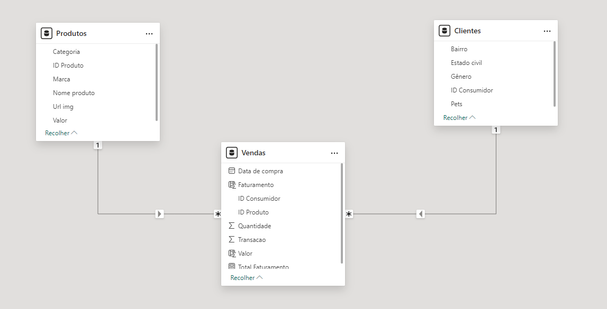

# Portfólio da Formação na Alura - Power BI 📊
Domine uma das mais populares ferramentas de Business Intelligence do mercado e alavanque sua carreira! 

Dashboards elaborados com foco em estudos na ferramenta Power BI:

- [Conhecendo a Ferramenta](https://github.com/heitordeve/Curso-PowerBI-Alura/tree/main/1.Conhecendo%20a%20Ferramenta)
- [Construindo Visualizações](https://github.com/heitordeve/Curso-PowerBI-Alura/tree/main/2.Construindo%20Visualiza%C3%A7%C3%B5es)
- [Tratando Dados](Em Breve)
- [Criando Medidas](Em Breve)
- [Elaborando DashBoards e Relatórios](Em Breve)
- [Acessando o Serviço](Em Breve)

### Dashboard - Conhecendo a Ferramenta

    

Acesse o dashboard completo [neste link](https://app.powerbi.com/view?r=eyJrIjoiYjc3N2YxMWItZGFiOS00Y2JiLWI2NjMtM2ZiZmM5OTQwOWU5IiwidCI6ImE5OWQ0NzdiLTg5OGQtNDEyYS1iZTQyLTJlMWFkN2ZiYmYyYyJ9)

#### Estrutura da base de dados

- Arquivo no formato Excel
- Arquivo no formato txt
- Arquivos no formato em Excel em uma pasta

### DER

    

#### Tipo de Análises Feitas

- Total de Faturamento
- Média de Pets por Dono
- Quantidade de Produtos Vendidos
- Total de Faturamento por Gênero
- Total de Faturamento por Bairro
- Faturamento em relação ao tempo

#### Tipos de Elementos gráficos e filtros

- Gráfico Pizza
- Gráfico de Linhas
- Gráfico de Barras Horizontais
- Cartões
- Dados Segmentados

### Visuais Obtidos
- Text Filter
- Image Grid

### Dashboard - Construindo Visualizações

    

Acesse o dashboard completo [neste link](https://app.powerbi.com/view?r=eyJrIjoiMmExNjc5ZmItOGYyOC00ZWI0LTk4YWEtNWRhZDhkZTZiYTAzIiwidCI6ImE5OWQ0NzdiLTg5OGQtNDEyYS1iZTQyLTJlMWFkN2ZiYmYyYyJ9)

#### Estrutura da base de dados

- Arquivo no formato Excel

### DER

    

#### Tipo de Análises Feitas

- E-Commerce

    - Média de Inativos
    - Média de Acessos
    - Soma de valor por título

- Vendas
    - Progesso das vendas de acordo com a meta
    - Meta de Vendas
    - Vendas por semana

- Clientes
    - Média de idade
    - Profissão mais frequente
    - Forma de contato preferida de acordo com o público

#### Tipos de Elementos gráficos e filtros

- Gráfico Pizza
- Gráfico de Linhas
- Gráfico de Barras Horizontais
- Cartões
- Mapa

### Visuais Obtidos
- Table Heat

